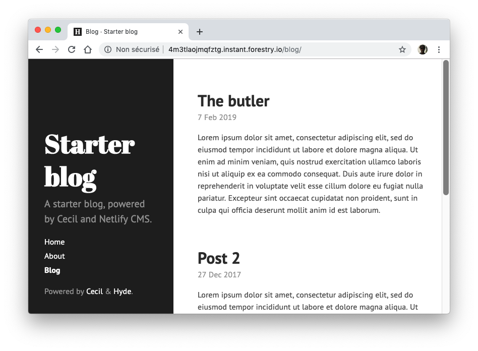

# The Butler

> A ready to use static blog, powered by [Cecil](https://cecil.app).

## There is a demo?

:arrow_forward: [the-butler.cecil.app](https://the-butler.cecil.app) (theme: [Hyde](https://github.com/Cecilapp/theme-hyde#readme))  
:arrow_forward: [the-butler-garth.now.sh](https://the-butler-garth.now.sh) (theme: [Garth](https://github.com/Cecilapp/theme-garth#readme))

## How to use?

### Managing content

#### With [Forestry](https://forestry.io)

If your goal is managing content quickly, and decide later where to deploy to it, use the following button to import the starter blog to Forestry CMS and start editing immediatelly!

#### Manually

Edit content files in `content/blog/` directly from your repository.

### Deploy

#### To [Netlify](https://www.netlify.com) ([demo](https://the-butler.cecil.app))

To use [**Netlify CMS**](https://www.netlifycms.org) ([demo](https://the-butler.cecil.app/admin/)) you must:
1. enable [Netlify Identity](https://docs.netlify.com/visitor-access/git-gateway/#setup-and-settings) and Git Gateway
2. invite a user
3. connect to `https://<your-blog>.netlify.com/admin/` with the user credentials

#### To [Vercel](https://vercel.com) ([demo](https://vercel.cecil.app))

#### To [Render](https://render.com) ([demo](https://the-butler.onrender.com))

#### With [Travis CI](https://travis-ci.com)

See [Travis config file](/.travis.yml).

#### With [GitLab CI](https://about.gitlab.com/stages-devops-lifecycle/continuous-integration/) ([demo](https://narno.gitlab.io/the-butler/))

See [GitLab config file](/.gitlab-ci.yml).

#### With [GitHub Actions](https://github.com/features/actions) ([demo](https://cecilapp.github.io/the-butler/))

Edit [GitHub Actions workflow file](/.github/workflows.disabled/build-and-deploy.yml) and rename `workflows.disabled` to `workflows` to enable the workflow.

### Customize your blog

1. Update configuration by editing `config.yml` file
2. Change templates by copying files from `themes/<theme>/layouts/` to your own `layouts/` directory to _override_ them.

## Need Help?

Read the [Cecil's documentation](https://cecil.app/documentation/).

## License

Starter blog is a free software distributed under the terms of the MIT license.

© [Arnaud Ligny](https://arnaudligny.fr)
